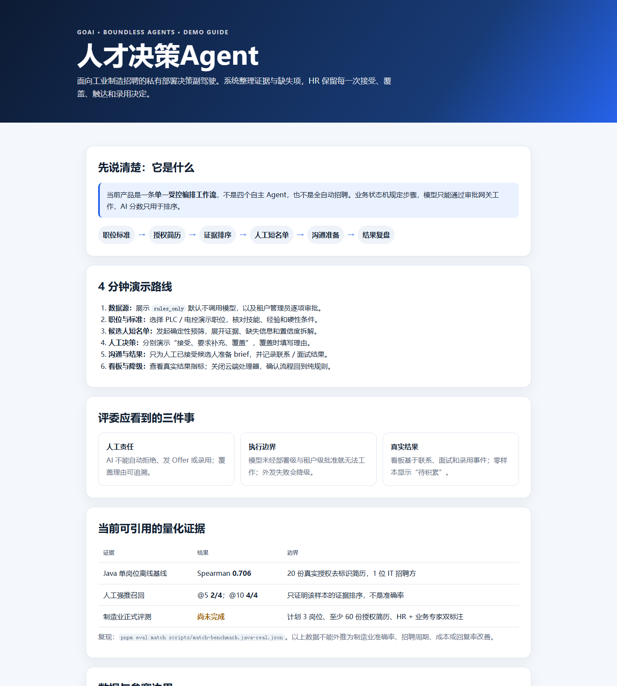

# 人才决策Agent

 

基于 Next.js 16 的企业私有部署招聘决策副驾驶，面向工业制造与 IT 外包等人力密集行业的人才供应链场景。系统接入现有 ATS 或已授权简历源，帮助 HR 生成可解释短名单、记录人工判断、准备沟通并用真实招聘结果持续校准。它不是完整 ATS，也不会自动拒绝、发 Offer 或录用候选人。

默认 `AI_EXECUTION_MODE=rules_only`，不调用模型或知识服务。部署模式只是能力上限，每个企业仍须由管理员在“数据源”页单独批准；只有逐项批准 `APPROVED_CLOUD_PROCESSORS` 且启用去标识化后，才可使用经批准的云端模型。

当前实现是一条**受控招聘编排工作流**，由确定性评分、可选 LLM 能力、本地知识工具、异步 Worker 和人工决策节点共同完成任务；不把固定流程包装成“多个自主 Agent”。GOAI 参赛交付只使用企业已授权简历库、CSV/JSON 与正式 ATS 接口，外部招聘平台浏览器自动化默认关闭且不属于参赛演示范围。

## 快速开始

1. 按 [Mac mini M4 数据库安装步骤](docs/Mac-mini-M4数据库安装步骤.md) 启动自托管 Supabase。
2. 复制 `.env.example` 为 `.env.local`，填写 Supabase 和安全密钥；仅在显式启用模型模式时配置对应模型端点与密钥。
3. 初始化并启动应用：

```bash
pnpm install
pnpm db:migrate
pnpm admin:bootstrap
pnpm seed:demo
pnpm dev
```

`admin:bootstrap` 仅用于创建首个组织管理员。执行时临时注入 `.env.example`
中列出的 `BOOTSTRAP_ADMIN_*` 和 `BOOTSTRAP_ORGANIZATION_*` 变量，成功后立即删除。

启动后访问 [http://localhost:5000](http://localhost:5000)。生产构建使用：

```bash
pnpm build
pnpm start
```

Docker 部署不会把整份 `.env.local` 注入容器。先将以下密钥分别写入
`secrets/` 下的同名文件（每个文件只保存密钥值）：

```text
SUPABASE_ANON_KEY
SUPABASE_SERVICE_ROLE_KEY
LLM_API_KEY
ENCRYPTION_KEY
HMAC_KEY
JWT_SECRET
SUPABASE_JWT_SECRET
```

`.env.local` 仅用于 Compose 插值非敏感配置；确保其中的 `SUPABASE_URL`
在容器内可达，Mac 上连接宿主机 Supabase 时使用
`http://host.docker.internal:8000`。然后运行：

```bash
docker compose --env-file .env.local up --build
```

`scripts/init-db.sh` 只执行迁移。管理员初始化和演示数据灌入必须分别显式执行，
避免生产容器因残留环境变量自动创建管理员或写入演示数据。

简历批处理 Worker 独立运行：复制 `assets/.env.worker.example` 为 `assets/.env.worker`，然后在 `assets` 目录执行：

```bash
uv run resume_batch_worker.py
```

批量匹配使用数据库任务队列。非 Docker 部署还需在项目根目录启动匹配 Worker：

```bash
pnpm worker:match
pnpm worker:integration
```

Docker Compose 已包含 `match-worker` 和 `integration-worker` 服务。结果事件与 ATS 回写意图可在同一数据库事务中提交，真正的外部 HTTPS 调用只由 Worker 异步执行；目标主机必须精确列入 `INTEGRATION_OUTBOUND_ALLOWED_HOSTS`，为空时全部拒绝。部署本版本前必须重新运行 `pnpm db:migrate`，以创建短名单、结果事件、数据接入、事务回写和决策指标所需对象。

CSV/JSON 基线既支持把外部 ID 映射到已有实体，也支持直接导入新实体。新职位必须提供 `data.title`；新候选人必须同时提供 `data` 和完整 `authorization`，敏感字段会在入库前加密。CSV 使用 `data_json`、`authorization_json` 两列承载相同结构。每页最多 100 条，实体、映射与同步游标在同一事务提交。

提交前质量门禁：

```bash
pnpm validate
pnpm test
pnpm build
pnpm worker:build
cd assets && uv run --locked python -m unittest discover -s tests -v
```

数据库测试会使用仓库自带的临时 PostgreSQL 配置，覆盖迁移幂等、RLS、完整决策流程、真实导入、原子回写、最强清理和 100 候选人性能包络，不依赖开发者数据库凭证。

## 产品截图

公开演示指南来自当前本地 `docker compose` 环境。



登录后的候选人短名单、数据源和职位页面请以运行中的系统为准。原截图含旧产品名，已撤下；完成正常登录后再重新拍摄。

## 核心工作流与指标

1. 在“职位与标准”确认岗位要求并发起短名单。
2. 在“候选人短名单”查看证据、缺失信息和证据充分度；由 HR 明确接受、要求补充或覆盖推荐。
3. 只有最新人工结论为“已接受”的候选人才可准备沟通 brief。
4. 在“沟通与结果”记录触达、回复、面试、Offer、录用、撤回和投诉等真实事件。
5. “决策看板”展示合格面试数、首份合格短名单耗时、人工接受/覆盖、回复与后续转化、撤回/投诉及隐私处理 SLA；零分母显示“待积累”，不使用平均模型分冒充业务结果。

AI 分数只参与排序。每条推荐保存版本化置信度拆解、结构化证据、缺失信息和人工覆盖原因；所有结果事件追加保存，普通用户不能改写历史。

简历批处理首次部署与钉钉 MCP 配置见
[简历批处理与钉钉写回部署说明](docs/简历批处理与钉钉写回部署说明.md)。

## 项目结构

```
├── public/                  # 静态资源（含 demo-guide.html 演示指南）
├── docs/                    # 部署与方案文档
├── assets/                  # 本地知识库、简历批处理 Python Worker、报告模板、unittest
├── scripts/                 # 迁移、种子数据、管理员初始化、Worker、启动与测试脚本
├── src/
│   ├── app/                 # 页面路由与 API
│   │   ├── (workspace)/     # analytics / candidates / data-sources / jobs / matching / outcomes / pipeline / shortlists
│   │   ├── api/             # 后端 API（认证、匹配、短名单、集成、简历批处理等）
│   │   └── resume-batch/    # 简历批处理页
│   ├── features/workspace/  # 工作区特性模块（components / hooks / lib / types）
│   ├── lib/
│   │   ├── ai/              # LLM 抽象层、本地知识库、执行策略、AI 网关
│   │   ├── matching/        # 评分、短名单、置信度
│   │   ├── privacy/         # 授权与候选人权利
│   │   └── integrations/    # ATS 集成、webhook、CSV 写回
│   └── storage/database/    # Supabase 客户端封装
├── Dockerfile / docker-compose.yml
└── scripts/migrate.sql      # 生产数据库完整定义
```

## AI 执行边界

- `rules_only`（默认）：不调用任何模型或知识服务，全部能力由规则引擎承载。
- `private_endpoint`：企业私有 OpenAI 兼容端点。
- `approved_cloud`：经批准的外部端点，且仅发送去标识化载荷（不含姓名、联系方式、公司名、原始简历）。
- 部署模式只是能力上限；每个租户还须在“数据源”页由管理员逐项批准后方可启用，未批准自动降级为 `rules_only`。
- 知识库完全本地：`assets/` 下 Markdown 分块检索，无外部检索服务。

## 第三方依赖与外部服务披露

开源依赖以 `pnpm-lock.yaml` 与 `assets/uv.lock` 为准。主要有：Next.js / React / Radix UI / Tailwind CSS（MIT）、openai SDK（Apache-2.0）、supabase-js（MIT）；Python Worker 侧 cryptography、pdfplumber（MIT）、requests（Apache-2.0）、supabase（MIT）等，其中 PyMuPDF 为 AGPL-3.0/商业双许可，仅用于扫描版 PDF 的本地渲染，运行在部署方机器、不进入 Web 端构建。

参赛交付涉及的外部服务仅以下三类，无其他隐蔽调用；所有出站能力默认关闭或拒绝：

| 服务 | 调用环节 | 费用假设 | 权限与边界 | 可替代性 / 锁定风险 |
|---|---|---|---|---|
| 阿里云百炼（OpenAI 兼容端点，默认 qwen-plus / qwen-vl-max） | JD 解析、单人深度匹配、话术生成、扫描版 PDF 视觉结构化（默认关闭） | 部署方自有 API Key、按 token 计费；系统不代收代付 | approved_cloud 下仅发送去标识化载荷，需部署级 + 租户级双重审批 | 任意 OpenAI 兼容端点经 `LLM_BASE_URL` / `LLM_MODEL` 可切换；rules_only 完全不调模型，锁定风险低 |
| 企业 ATS / CSV / JSON | 授权候选人导入与结果写回 | 由部署方现有系统决定 | 导入须携带授权记录；写回仅允许精确 HTTPS 主机白名单 | CSV/JSON 可作为无外部依赖基线 |
| 钉钉 MCP（可选） | 简历批处理写回 | 依赖部署方自有钉钉应用 | 默认关闭，需管理员显式配置 | 可选通道，不影响主流程 |

仓库保留的实验性浏览器自动化代码不属于参赛交付，`ENABLE_BOSS_SEARCH=false` 时页面、API 与命令行入口均拒绝运行。任何启用都以目标平台书面授权、账号授权和独立法律审查为前提。完整依赖与发布边界见 [第三方依赖与发布边界](docs/第三方依赖与发布边界.md)。

## 质量门禁

```bash
pnpm validate   # tsc + eslint --quiet
pnpm test       # TS 单测（node:test）+ 数据库集成测试（docker compose）
pnpm build
cd assets && uv run --locked python -m unittest discover -s tests -v
```

GitHub Actions 对每次推送运行 `validate` + 单元测试 + Python Worker 测试。

## 技术栈

- **框架**: Next.js 16 (App Router) + React 19 + TypeScript 5 (strict)
- **UI**: shadcn/ui (Radix UI) + Tailwind CSS 4
- **数据库**: Supabase (PostgreSQL，可 Docker 自托管)
- **AI**: OpenAI 兼容抽象层（默认阿里云百炼 `qwen-plus`），本地 Markdown 知识库
- **Worker**: TypeScript / Python（pnpm + uv 管理）——批量匹配、ATS 写回与简历批处理
- **包管理器**: pnpm 9+（`preinstall` 拦截 npm/yarn）

## 项目文档

- [AGENTS.md](AGENTS.md) — 项目上下文与开发规范
- [DESIGN.md](DESIGN.md) — 设计规范
- [docs/Mac-mini-M4数据库安装步骤.md](docs/Mac-mini-M4数据库安装步骤.md) — 自托管 Supabase 安装
- [docs/简历批处理与钉钉写回部署说明.md](docs/简历批处理与钉钉写回部署说明.md)
- [docs/GOAI参赛说明_无界应用.md](docs/GOAI参赛说明_无界应用.md) — GOAI 无界应用赛道参赛说明（目标用户/闭环/架构/合规/实现边界）
- [docs/GOAI作品简介_500字.md](docs/GOAI作品简介_500字.md) — 初赛提交用作品简介（≤500 字）
- [docs/GOAI无界应用_方案PPT.pptx](docs/GOAI无界应用_方案PPT.pptx) — 初赛方案 PPT
- [docs/GOAI无界应用_方案PPT.pdf](docs/GOAI无界应用_方案PPT.pdf) — 与 PPT 同版的 12 页评审 PDF
- [docs/数据合规与隐私白皮书.md](docs/数据合规与隐私白皮书.md) — 数据合规与隐私保护全文
- [docs/评测报告_2026-08.md](docs/评测报告_2026-08.md) — IT 单岗位真实数据基线：Spearman 0.706、NDCG@10 0.844、Precision@5 0.400、强推召回率@10 4/4（可复现，不外推为制造业结论）
- [docs/evidence/java-resume-source-audit-2026-08-09.md](docs/evidence/java-resume-source-audit-2026-08-09.md) — 20 份授权 Java PDF 的本地完整性、匿名映射与结构化差异核对
- [docs/制造业评测方案.md](docs/制造业评测方案.md) — PLC / 工业机器人 / 设备维护三岗位正式评测协议与验收门槛
- [outputs/019fef1a-mfg-final-v1/制造业三岗位真实简历评测审计报告_V1.xlsx](outputs/019fef1a-mfg-final-v1/制造业三岗位真实简历评测审计报告_V1.xlsx) — 制造业三岗位 58 份真实简历 HR 与 AI 双轨标注审计：一致率 34.5%、加权 κ=0.280，定位“提供证据、人工决策”，不宣称专家真值
- [docs/第三方依赖与发布边界.md](docs/第三方依赖与发布边界.md) — 直接依赖、外部服务与参赛发布边界
- [docs/evidence/README.md](docs/evidence/README.md) — 运行证据与质量门禁证据包
- [docs/evidence/从零复现演练_2026-08-05.md](docs/evidence/从零复现演练_2026-08-05.md) — Docker 全链路从零复现演练与回归修复记录

## 项目来源与已有基础

本项目前身为团队 2025 年火山杯参赛原型（初版基于第三方 Agent 平台 Coze 搭建）。当前仓库为同一团队的完全重构迭代：去除平台 SDK、改为自托管 Next.js + Supabase 架构，并新增 AI 执行边界治理、短名单决策留痕、结果复盘校准等体系化能力；代码全部自研，不含第三方专有代码。旧版参赛材料中的场景调研与量化分析延续至文档并已用真实数据重新验证（见评测报告）。仓库自初始提交即以 Apache-2.0 许可，权利人同为团队成员，无许可兼容问题。

## 开源许可

本项目基于 [Apache License 2.0](LICENSE) 开源。
